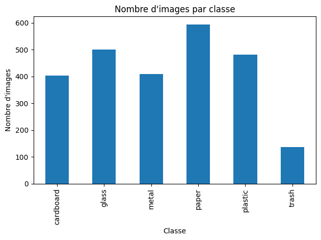
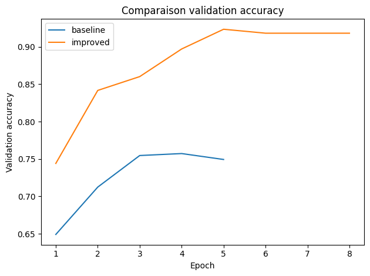
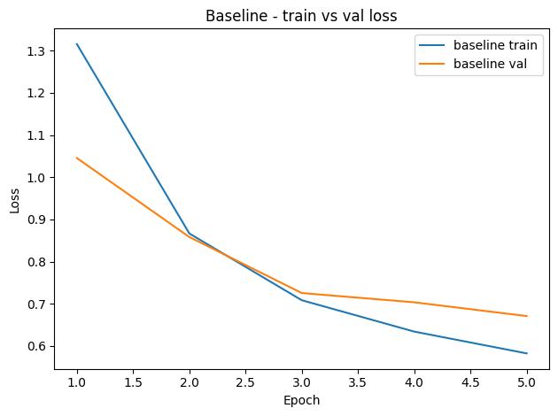
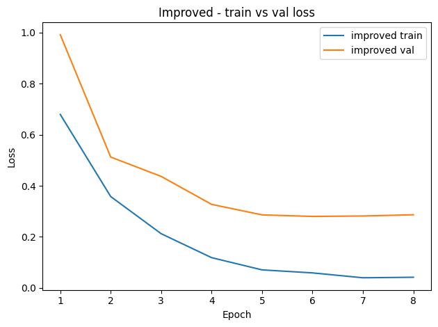

# Mini Projet Vision - Classification des déchets

## 1. Objectif
Construire un pipeline complet pour classifier des images de déchets en 6 classes.

## 2. Dataset
- 2527 images
- Classes : cardboard, glass, metal, paper, plastic, trash

## 3. Pipeline
- Téléchargement Kaggle
- Inventaire des images
- Split train/val/test
- Préprocessing (224x224)
- Baseline HOG + SVM
- CNN ResNet18
- API FastAPI
- Docker

## 4. Résultats

### Baseline (HOG + SVM)
Validation accuracy: 0.4617
Test accuracy: 0.4526

Classification report (test):

              precision    recall  f1-score   support

   cardboard       0.53      0.53      0.53        60
       glass       0.39      0.38      0.38        76
       metal       0.37      0.39      0.38        62
       paper       0.57      0.62      0.59        89
     plastic       0.40      0.40      0.40        73
       trash       0.27      0.15      0.19        20

    accuracy                           0.45       380
   macro avg       0.42      0.41      0.41       380
weighted avg       0.45      0.45      0.45       380

### CNN baseline
best_epoch: 4
best_val_acc: 0.7573
test_acc: 0.7711
test_loss: 0.6469

classification_report:
              precision    recall  f1-score   support

   cardboard     0.8333    0.9167    0.8730        60
       glass     0.7424    0.6447    0.6901        76
       metal     0.7258    0.7258    0.7258        62
       paper     0.9136    0.8315    0.8706        89
     plastic     0.6630    0.8356    0.7394        73
       trash     0.6923    0.4500    0.5455        20

    accuracy                         0.7711       380
   macro avg     0.7617    0.7340    0.7407       380
weighted avg     0.7763    0.7711    0.7689       380

confusion_matrix:
[[55  0  1  4  0  0]
 [ 2 49  6  0 19  0]
 [ 2  8 45  0  6  1]
 [ 6  1  3 74  3  2]
 [ 0  6  4  1 61  1]
 [ 1  2  3  2  3  9]]

### CNN improved
best_epoch: 5
best_val_acc: 0.9235
test_acc: 0.9079
test_loss: 0.2896

classification_report:
              precision    recall  f1-score   support

   cardboard     0.9818    0.9000    0.9391        60
       glass     0.9296    0.8684    0.8980        76
       metal     0.8714    0.9839    0.9242        62
       paper     0.8673    0.9551    0.9091        89
     plastic     0.9178    0.9178    0.9178        73
       trash     0.9231    0.6000    0.7273        20

    accuracy                         0.9079       380
   macro avg     0.9152    0.8709    0.8859       380
weighted avg     0.9112    0.9079    0.9062       380

confusion_matrix:
[[54  1  0  4  0  1]
 [ 0 66  5  0  5  0]
 [ 0  1 61  0  0  0]
 [ 0  1  2 85  1  0]
 [ 0  2  2  2 67  0]
 [ 1  0  0  7  0 12]]

## 5. Analyse

- Le CNN est meilleur que la baseline classique
- La config improved améliore les performances
- Le dataset est légèrement déséquilibré (classe trash faible)

## 6. Visualisations

## 7. Conclusion

Le modèle CNN permet de bien classifier les déchets.
Le pipeline est reproductible et déployé via API et Docker.

